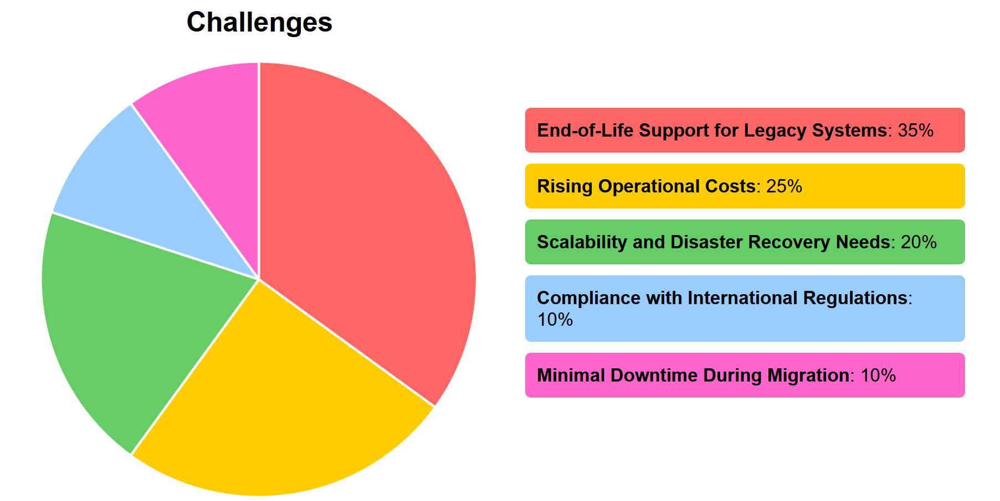

# Part 2: Legacy System Modernization (ERP and Mainframe)

### Refactoring the Monolithic ERP System
The existing monolithic ERP system, which supports **financial and inventory management**, will be transformed into a **microservices-based** architecture hosted on **Azure App Service (ASE)**. This modernization strategy aims to enhance scalability, maintainability, and operational efficiency. The ERP's transition will include:  

### Decomposition of Monolithic Architecture
The system will be broken into distinct functional modules, each representing a microservice. These microservices will communicate through APIs, enabling independent scaling and deployment while maintaining cohesive integration.  

### Availability Implementation
To ensure minimal downtime, Azure Front Door will act as the global load balancer. This setup enhances fault tolerance and ensures optimal user experiences across diverse geographies.  

### Modern Development Practices
The use of **Azure DevOps pipelines** will support continuous integration and deployment **(CI/CD)**, automating testing, delivery, and scaling processes. This approach minimizes deployment risks and accelerates updates.  

### Modernizing the Legacy Mainframe System
The legacy mainframe system, which handles payroll and reporting, will either be rehosted or entirely replaced with modern Azure solutions, depending on its criticality and technical feasibility.  

#### Rehosting Option with Azure VMware Solution
For minimal disruption, rehosting workloads on Azure VMware Solution ensures compatibility with existing applications while leveraging **cloud scalability and availability**.  

### Replacement Using Azure Functions and Logic Apps
Replacing the mainframe system with **Azure Functions** enables event-driven execution, ideal for handling payroll calculations and reporting tasks dynamically. Azure Logic Apps will orchestrate workflows, connecting on-premises and cloud services seamlessly.  

### Integration of Modern Workflows
**Azure Logic Apps** will act as the backbone for modernized workflows, enabling automated data exchanges between payroll services, ERP systems, and reporting tools. Event-driven architecture will replace traditional batch processing, providing real-time insights and operational efficiency.  

---

## Challenges

### End-of-Life Support for Legacy Systems
As the legacy ERP system and mainframe neared the end of their support lifecycle, we faced growing concerns regarding *security vulnerabilities, outdated technology, and operational inefficiencies*. These systems were increasingly prone to failures, making it difficult to keep up with business demands and maintain the necessary security standards. To address this, we opted to refactor the ERP system into microservices using Azure App Service, allowing for a more modern, maintainable architecture. The mainframe was rehosted using Azure VMware Solution, which enabled us to preserve legacy functionality while migrating to the cloud without requiring a complete rebuild.  

### Rising Operational Costs
Maintaining on-premises data centers was becoming increasingly *expensive* due to the *high costs associated with hardware, cooling, power, and administrative overhead*. The growing expense of managing these physical resources was unsustainable, especially as the organization needed to scale its infrastructure to meet business demands. To overcome this, we transitioned to Azure’s pay-as-you-go pricing model, which allowed us to reduce capital expenditures by replacing physical infrastructure with virtual resources. This approach not only optimized costs but also provided the flexibility to scale resources dynamically, reducing waste and improving cost efficiency.  

### Scalability and Disaster Recovery Need 
The legacy infrastructure *lacked the ability to scale dynamically* with the growing demands of the business. Additionally, the disaster recovery plan was inadequate, which posed a significant risk to business continuity in the event of an outage or failure. The organization required a solution that could provide high availability and a robust disaster recovery plan. To meet these needs, we adopted **Azure Kubernetes Service (AKS)** for dynamic scaling of our e-commerce applications, and implemented Azure Backup and Recovery Vault to ensure business continuity with quick data restoration in case of a failure. Azure’s availability zones and **global load balancing** through Azure Front Door also ensured high availability and minimized the risk of service disruptions.  

### Compliance with International Regulations 
As the organization operates in industries that are subject to strict regulatory requirements, such as GDPR and HIPAA, we faced challenges ensuring that the **legacy systems complied with modern data protection and privacy standards**. Ensuring compliance with these regulations was complex due to the outdated security measures of the legacy systems. We overcame this challenge by leveraging Azure’s built-in compliance framework, which includes certifications for GDPR and HIPAA. Additionally, we implemented **Azure Key Vault** for secure management of sensitive data and used Azure Policy to enforce compliance rules across the cloud infrastructure, ensuring that all systems adhered to required regulatory standards.  

### Minimal Downtime During Migration 
Minimizing downtime during the migration of critical services was essential to prevent disruptions in business operations. With many key processes dependent on the legacy ERP and e-commerce applications, any prolonged downtime could result in significant losses and operational delays. To address this challenge, we used **Azure Migrate and Azure Site Recovery** to carefully plan and execute the migration in phases, with clear rollback strategies. This approach allowed for the smooth migration of workloads while ensuring minimal disruption. We also implemented failover mechanisms and used **Azure Front Door** for high availability, keeping downtime to a minimum and ensuring that critical services remained operational throughout the transition.  

## Part 3 Security and Data Protection

# Part 4: Cost Estimation
### **Cost Estimation for GlobalTech Solutions on Azure**  

The table below provides the detailed **cost estimation** for migrating GlobalTech Solutions' infrastructure to Azure, breaking down the monthly and yearly costs for each service.

### **1. Monthly and Yearly Cost Estimation**

| **Service Category**          | **Resource/Service**                                                                                         | **Estimated Monthly Cost ($)** | **Estimated Yearly Cost ($)** |
|-------------------------------|-------------------------------------------------------------------------------------------------------------|--------------------------------|--------------------------------|