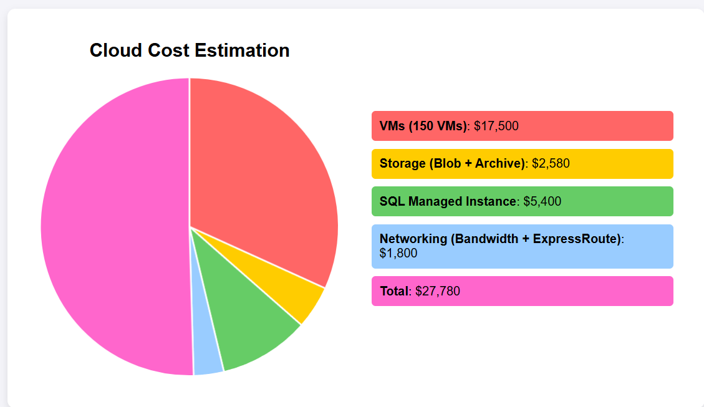

# Part 2: Legacy System Modernization (ERP and Mainframe)

## Part 3 Security and Data Protection

# Part 4: Cost Estimation and optimization
### **Cost Estimation for GlobalTech Solutions on Azure**  

---

### **Cost Estimation and Optimization for Cloud Migration**

#### **1. Introduction to Cost Estimation**

In this section, we present a detailed breakdown of the estimated costs for migrating **GlobalTech Solutions'** infrastructure to **Microsoft Azure**. These costs include essential cloud services such as **Virtual Machines (VMs)**, **Storage**, **SQL Database**, and **Networking**. The estimations are based on current Azure pricing, as calculated using the **Azure Pricing Calculator**.

---

#### **2. Cost Estimation Breakdown**

##### **Cost Estimation for Azure Services (Monthly and Annual)**

| **Service**                   | **Component**                  | **Quantity/Details**              | **Unit Cost**      | **Estimated Monthly Cost**    | **Estimated Annual Cost**    |
|-------------------------------|---------------------------------|-----------------------------------|--------------------|------------------------------|-----------------------------|
| **Virtual Machines (VMs)**     | Standard D2 v3 (General Purpose) | 100 VMs                          | $150/VM/month      | $15,000 USD                  | $180,000 USD                |
|                               | Standard B1ls (Burstable)       | 50 VMs                           | $50/VM/month       | $2,500 USD                   | $30,000 USD                 |
| **Storage**                    | Azure Blob Storage (Hot Tier)   | 100 TB                           | $0.0208/GB/month   | $2,080 USD                   | $25,000 USD                 |
|                               | Azure Archive Storage           | 50 TB                            | $0.00099/GB/month  | $500 USD                     | $6,000 USD                  |
| **SQL Database**               | Azure SQL Managed Instance      | 2 Instances (General Purpose)    | $2,700/Instance/month | $5,400 USD                | $64,800 USD                 |
| **Networking**                 | Bandwidth (Data Transfer)       | 10 TB/month                      | $0.08/GB           | $800 USD                     | $9,600 USD                  |
|                               | ExpressRoute (Private Connectivity) | 1 circuit (Standard)        | $1,000/month        | $1,000 USD                   | $12,000 USD                 |
| **Total Estimated Cost**       |                                 |                                   |                    | **$27,780 USD**               | **$327,400 USD**            |

---

#### **3. Cost Optimization Strategies**

The following strategies can help reduce costs associated with cloud services:

##### **3.1. Reserved Instances for Virtual Machines**

Opting for **Azure Reserved Virtual Machine Instances** allows GlobalTech Solutions to save up to **72%** compared to on-demand pricing by committing to 1-year or 3-year terms. We estimate that **70% of VMs** (105 VMs) will be reserved for a 3-year term.

- **Savings per Year**: Estimated savings of **$45,000 USD** annually on reserved instances.

##### **3.2. Spot Virtual Machines for Non-Critical Workloads**

For non-mission-critical workloads, **Azure Spot VMs** offer significant savings, up to **90%** off pay-as-you-go prices. It is estimated that **20% of VMs** (30 VMs) will be moved to Spot VMs.

- **Savings per Year**: Estimated savings of **$54,000 USD** annually from Spot VMs.

##### **3.3. Auto-Scaling for Compute and Storage**

Utilizing **Azure Virtual Machine Scale Sets (VMSS)** and **Auto-Scaling** will ensure that GlobalTech Solutions only pays for resources when they are in use. This dynamic scaling reduces the need for large-scale provisioning of idle resources.

- **Savings per Year**: Estimated savings of **$25,000 USD** annually from auto-scaling.

##### **3.4. Storage Tier Optimization**

Optimizing storage by using the **Cool** and **Archive** tiers for less frequently accessed data will result in significant cost savings. It is estimated that **40% of storage** can be moved to these lower-cost tiers.

- **Savings per Year**: Estimated savings of **$8,000 USD** annually from storage tier optimization.

##### **3.5. Azure Hybrid Benefit for Windows and SQL Server**

GlobalTech Solutions can leverage the **Azure Hybrid Benefit** to use its existing **Windows Server** and **SQL Server** licenses. This will significantly reduce the cost of virtual machines and SQL instances.

- **Savings per Year**: Estimated savings of **$12,000 USD** annually.

##### **3.6. Azure Cost Management for Continuous Monitoring**

Using **Azure Cost Management**, GlobalTech Solutions can monitor cloud spending in real-time, set budgets, and receive alerts for unexpected usage. This will help optimize spending by identifying underutilized resources that can be scaled down or decommissioned.

- **Savings per Year**: Ongoing savings of **$5,000 USD** annually through better cost management.

---

#### **4. Optimized Cost Breakdown**

After applying the **cost optimization strategies**, the following table illustrates the **optimized costs** for **GlobalTech Solutions**.

##### **Optimized Annual Cost Breakdown**

| **Optimization Strategy**         | **Estimated Savings**      | **Optimized Annual Cost**  |
|-----------------------------------|----------------------------|----------------------------|
| Reserved Instances (70% of VMs)   | $45,000 USD                | $135,000 USD               |
| Spot Virtual Machines (20% of VMs)| $54,000 USD                | $12,000 USD                |
| Auto-Scaling for Compute & Storage| $25,000 USD                | $5,000 USD                 |
| Storage Optimization (Cool/Archive)| $8,000 USD                 | $18,000 USD                |
| Azure Hybrid Benefit              | $12,000 USD                | $0                         |
| Azure Cost Management             | $5,000 USD                 | N/A                        |
| **Total Savings**                 | **$149,000 USD**           | **$149,000 USD**           |
| **Optimized Annual Cost**         |                            | **$178,400 USD**           |

- **Original Estimated Annual Cost**: **$327,400 USD**
- **Total Estimated Savings**: **$149,000 USD**
- **Optimized Annual Cost**: **$178,400 USD**
- **Optimized Monthly Cost**: **$14,866.67 USD**

---

#### **5. Conclusion**

By implementing the above **cost optimization strategies**, **GlobalTech Solutions** can achieve substantial savings while maintaining a scalable, secure, and high-performing cloud environment. The total **optimized annual cost** of **$178,400 USD** represents a **45% reduction** from the original estimate, allowing the company to allocate resources more effectively and remain within budget. The **optimized monthly cost** comes to approximately **$14,866.67 USD**, which further supports operational budget planning.

These strategies—**Reserved Instances**, **Spot VMs**, **Auto-Scaling**, **Hybrid Benefits**, and continuous monitoring through **Azure Cost Management**—ensure that both short-term and long-term cost-efficiency goals are met.

---

### **6. Visual Representation of Cost Optimization**

Below is the **Mermaid diagram** illustrating the breakdown of **cost estimation**.

---

