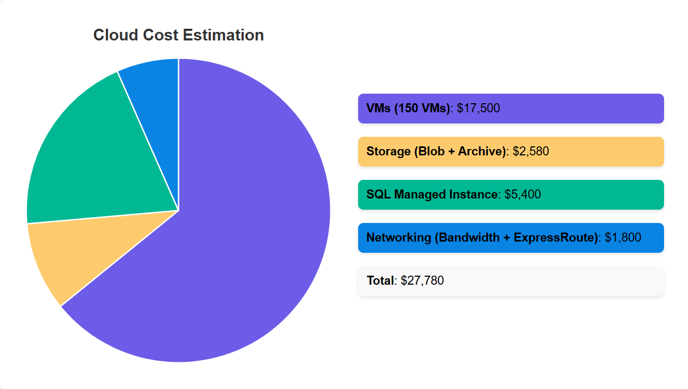

# GlobalTech Solutions Cloud Migration Project

# Project Overview

Azure is Microsoft’s cloud computing platform, offering a wide range of services for computing, storage, networking, AI, and app development. It enables businesses to build, deploy, and manage applications and infrastructure across a global network of data centers with scalability, reliability, and security.

This project focuses on migrating **GlobalTech Solutions' infrastructure** to Azure to address challenges related to scalability, modernization, compliance, and cost efficiency. The migration involves transitioning:

- 150 virtual machines
- A monolithic ERP system
- A SQL database cluster
- E-commerce applications
- A legacy mainframe system

---

## Key Objectives

1. **Scalability and Modernization**:  
   Leverage **Azure Kubernetes Service (AKS)** for modernization and ensure future scalability of applications and services.

2. **Compliance and Security**:  
   Adhere to international regulations such as **GDPR** and **HIPAA** using Azure's security and governance tools, including **Azure Security Center** and **Azure Policy**.

3. **Downtime Minimization**:  
   Ensure that downtime for critical systems does not exceed **4 hours** during the migration process.

4. **Cost Efficiency**:  
   Optimize costs and resource usage with tools like the **Azure Pricing Calculator**.

---
# Part 1: Azure Migration Strategy & Architecture

## On-Premises Infrastructure Overview

The diagram provides a high-level overview of the current on-premises infrastructure for **GlobalTech Solutions**, representing its key systems and their primary functions. Each component is critical to the company's operations and must be carefully considered during the cloud migration process. Below is a detailed breakdown of the systems illustrated:

### 1. Virtual Machines
- **Component**: Represents 150 virtual machines running a combination of Windows Server and Linux operating systems.  
- **Role**: Hosts a variety of applications and services critical to the company's day-to-day operations.  
- **Consideration for Migration**: A **lift-and-shift** strategy may be suitable for most VMs, but certain workloads may need **re-platforming** or **modernization**.

### 2. Monolithic ERP System
- **Component**: The legacy ERP system supports financial and inventory management.  
- **Role**: Provides core business operations but is nearing the end of its support lifecycle.  
- **Challenges**: Its **monolithic architecture** and outdated technology require careful **refactoring** or replacement with a **cloud-native ERP solution**.

### 3. Public-Facing E-Commerce Applications
- **Component**: A set of customer-facing applications requiring strict uptime and high availability.  
- **Role**: Supports the company’s e-commerce operations across multiple countries.  
- **Challenges**:  
  - Downtime during migration should not exceed **four hours**.  
  - A **hybrid migration strategy** with replication to the cloud is recommended to ensure a seamless transition.

### 4. In-House SQL Database Cluster
- **Component**: A centralized database cluster storing sensitive customer and operational data.  
- **Role**: Acts as the backbone for data storage and retrieval across various business applications.  
- **Challenges**:  
  - Compliance with international regulations such as **GDPR** and **HIPAA** is critical.  
  - Secure data encryption and migration to a **managed database service** in the cloud will be key.

### 5. Legacy Mainframe System
- **Component**: A legacy system used primarily for payroll and reporting.  
- **Role**: Although critical, this system is outdated and expensive to maintain.  
- **Challenges**:  
  - Its age and architecture require a **rehosting** or complete replacement with a modern, scalable alternative, such as **SaaS** or **serverless technologies**.

---
## Azure Cloud Infrastructure Overview

The diagram for the Azure Cloud Infrastructure represents the future IT landscape of GlobalTech Solutions after migrating its systems from on-premises to Microsoft Azure. It highlights the components that enable workload modernization while maintaining compliance with business and technical objectives.

### Core Components and Their Roles

### 1. Azure Virtual Machines (AVM)
- **Purpose**: Hosts workloads migrated from on-premises virtual machines using a lift-and-shift approach.  
- **Benefits**: Maintains compatibility with existing applications while leveraging Azure's scalability, cost management, and high availability.

### 2. Azure App Service (ASE)
- **Purpose**: Refactors the monolithic ERP into microservices hosted on this fully managed platform as part of modernizing the stack.  
- **Benefits**: Enables easy application management, auto-scaling, and integration with other Azure services.

### 3. Azure Kubernetes Service (AKS)
- **Purpose**: Hosts containerized e-commerce applications, providing high availability and rapid scaling based on demand.  
- **Benefits**: Handles orchestration, simple management, and reliability for containers.

### 4. Azure SQL Managed Instance (SQLMI)
- **Purpose**: Migrates the in-house SQL database cluster to a managed, scalable database service.  
- **Benefits**: Enhances performance, security, and compliance while reducing administrative overhead.

### 5. Azure Logic Apps (Logic)
- **Purpose**: Replaces legacy mainframe systems with serverless workflows for payroll and reporting.  
- **Benefits**: Offers cost-effective automation and seamless integration with other Azure services.

### 6. Azure Backup and Recovery Vault (Backup)
- **Purpose**: Safeguards critical systems against data loss or disasters with automated backups and recovery options.  
- **Benefits**: Provides business continuity and quick recovery solutions.

### 7. Azure Monitor (Monitor)
- **Purpose**: Monitors the performance, availability, and compliance of all cloud resources.  
- **Benefits**: Offers real-time insights and analytics to address issues proactively and ensure system reliability.

### 8. Azure Front Door (FrontDoor)
- **Purpose**: A global load balancer that optimally distributes traffic among e-commerce applications and ERP services.  
- **Benefits**: Enhances availability, minimizes latency, and ensures a seamless user experience.

### 9. Azure Key Vault
- **Purpose**: Secures sensitive data, such as encryption keys and secrets, for applications like SQL Managed Instance.  
- **Benefits**: Protects data with high-grade encryption and controlled access.

### 10. Azure Policy
- **Purpose**: Enforces compliance of Azure resources with international regulations like GDPR and HIPAA.  
- **Benefits**: Automates auditing and compliance enforcement, reducing risks and ensuring regulatory alignment.

---

## Interconnections and Relationships

### Backups for Disaster Recovery
- Azure Backup integrates with all critical systems, providing a centralized disaster recovery solution.

### Availability
- Azure Front Door works with Azure App Service and AKS to ensure availability and fast response times for end users.

### Compliance Audit
- Azure Monitor and Azure Policy collaborate to ensure compliance auditing and enforcement across the infrastructure.

### Data Security
- Azure Key Vault secures sensitive data through encryption and controlled access, integrating seamlessly with other services like SQLMI.

---

## Phases of Migration Using Azure Migrate

### 1. Assessment Phase
**Purpose**: Assess the existing on-premises environment readiness for migration.  

**Azure Migrate Role**:  
- **Discover and Inventory**: Discovers and inventories the on-premises resources (VMs, databases, applications).  
- **Dependency Mapping**: Analyzes application dependencies for an efficient migration plan.  
- **Sizing and Cost Prediction**: Provides right-sizing recommendations for Azure resources and migration cost estimation.

### 2. Planning Phase
**Objective**: Define the migration strategy and plan execution.  

**Azure Migrate Role**:  
- **Selection of Migration Strategy**: Helps determine the right migration approach (e.g., rehost, replatform, or refactor).  
- **Service Mapping**: Maps on-premises resources to their Azure counterparts (e.g., VMs to Azure Virtual Machines, databases to Azure SQL).  
- **Downtime Planning**: Estimates and plans downtime windows to ensure business continuity during migration.

### 3. Execution Phase
**Goal**: Migrate workloads to Azure with minimal disruption.  

**Azure Migrate Role**:  
- **Workload Migration**: Migrates Virtual Machines, databases, and applications to Azure using integrated tools like **Server Migration** and **Database Migration Service**.  
- **Containerization & Modernization**: Supports modernizing applications using **Azure Kubernetes Service (AKS)** and **Azure App Service**.  
- **Monitoring**: Monitors the migration process for potential issues and ensures successful execution.

### 4. Validation Phase
**Goal**: Confirm successful migration by ensuring workloads perform as expected.  

**Azure Migrate Role**:  
- **Testing**: Tests migrated workloads to verify functionality, performance, and security within Azure.  
- **Compliance and Performance Validation**: Validates compliance with regulations and ensures workloads meet performance benchmarks.  
- **Optimization**: Identifies opportunities to further optimize cost, performance, and security in the Azure environment.

---

# Part 2: Legacy System Modernization (ERP and Mainframe)

### Refactoring the Monolithic ERP System
The existing monolithic ERP system, which supports **financial and inventory management**, will be transformed into a **microservices-based** architecture hosted on **Azure App Service (ASE)**. This modernization strategy aims to enhance scalability, maintainability, and operational efficiency. The ERP's transition will include:  

### Decomposition of Monolithic Architecture
The system will be broken into distinct functional modules, each representing a microservice. These microservices will communicate through APIs, enabling independent scaling and deployment while maintaining cohesive integration.  

### Availability Implementation
To ensure minimal downtime, Azure Front Door will act as the global load balancer. This setup enhances fault tolerance and ensures optimal user experiences across diverse geographies.  

### Modern Development Practices
The use of **Azure DevOps pipelines** will support continuous integration and deployment **(CI/CD)**, automating testing, delivery, and scaling processes. This approach minimizes deployment risks and accelerates updates.  

### Modernizing the Legacy Mainframe System
The legacy mainframe system, which handles payroll and reporting, will either be rehosted or entirely replaced with modern Azure solutions, depending on its criticality and technical feasibility.  

#### Rehosting Option with Azure VMware Solution
For minimal disruption, rehosting workloads on Azure VMware Solution ensures compatibility with existing applications while leveraging **cloud scalability and availability**.  

### Replacement Using Azure Functions and Logic Apps
Replacing the mainframe system with **Azure Functions** enables event-driven execution, ideal for handling payroll calculations and reporting tasks dynamically. Azure Logic Apps will orchestrate workflows, connecting on-premises and cloud services seamlessly.  

### Integration of Modern Workflows
**Azure Logic Apps** will act as the backbone for modernized workflows, enabling automated data exchanges between payroll services, ERP systems, and reporting tools. Event-driven architecture will replace traditional batch processing, providing real-time insights and operational efficiency.  

---

## Challenges

### End-of-Life Support for Legacy Systems
As the legacy ERP system and mainframe neared the end of their support lifecycle, we faced growing concerns regarding *security vulnerabilities, outdated technology, and operational inefficiencies*. These systems were increasingly prone to failures, making it difficult to keep up with business demands and maintain the necessary security standards. To address this, we opted to refactor the ERP system into microservices using Azure App Service, allowing for a more modern, maintainable architecture. The mainframe was rehosted using Azure VMware Solution, which enabled us to preserve legacy functionality while migrating to the cloud without requiring a complete rebuild.  

### Rising Operational Costs
Maintaining on-premises data centers was becoming increasingly *expensive* due to the *high costs associated with hardware, cooling, power, and administrative overhead*. The growing expense of managing these physical resources was unsustainable, especially as the organization needed to scale its infrastructure to meet business demands. To overcome this, we transitioned to Azure’s pay-as-you-go pricing model, which allowed us to reduce capital expenditures by replacing physical infrastructure with virtual resources. This approach not only optimized costs but also provided the flexibility to scale resources dynamically, reducing waste and improving cost efficiency.  

### Scalability and Disaster Recovery Need 
The legacy infrastructure *lacked the ability to scale dynamically* with the growing demands of the business. Additionally, the disaster recovery plan was inadequate, which posed a significant risk to business continuity in the event of an outage or failure. The organization required a solution that could provide high availability and a robust disaster recovery plan. To meet these needs, we adopted **Azure Kubernetes Service (AKS)** for dynamic scaling of our e-commerce applications, and implemented Azure Backup and Recovery Vault to ensure business continuity with quick data restoration in case of a failure. Azure’s availability zones and **global load balancing** through Azure Front Door also ensured high availability and minimized the risk of service disruptions.  

### Compliance with International Regulations 
As the organization operates in industries that are subject to strict regulatory requirements, such as GDPR and HIPAA, we faced challenges ensuring that the **legacy systems complied with modern data protection and privacy standards**. Ensuring compliance with these regulations was complex due to the outdated security measures of the legacy systems. We overcame this challenge by leveraging Azure’s built-in compliance framework, which includes certifications for GDPR and HIPAA. Additionally, we implemented **Azure Key Vault** for secure management of sensitive data and used Azure Policy to enforce compliance rules across the cloud infrastructure, ensuring that all systems adhered to required regulatory standards.  

### Minimal Downtime During Migration 
Minimizing downtime during the migration of critical services was essential to prevent disruptions in business operations. With many key processes dependent on the legacy ERP and e-commerce applications, any prolonged downtime could result in significant losses and operational delays. To address this challenge, we used **Azure Migrate and Azure Site Recovery** to carefully plan and execute the migration in phases, with clear rollback strategies. This approach allowed for the smooth migration of workloads while ensuring minimal disruption. We also implemented failover mechanisms and used **Azure Front Door** for high availability, keeping downtime to a minimum and ensuring that critical services remained operational throughout the transition.  

---
## Part 3 Security and Data Protection

# Data Security and Compliance

## 1. Implementing Azure Security Center and Azure Sentinel for Security During Migration

### Azure Security Center (ASC)
- **Security Posture**:  
  Azure Security Center (ASC) continuously evaluates the security of both on-premises systems (like ERP and mainframes) and migrated workloads in Azure (like SQL databases, e-commerce applications). It scans for vulnerabilities and provides real-time recommendations to address security gaps during migration.

- **Threat Detection**:  
  ASC detects security threats as GlobalTech Solutions migrates critical systems (e.g., customer data, financial information). It monitors all Azure resources and offers threat detection capabilities to prevent and respond to potential breaches.

- **Security Compliance**:  
  With GDPR and HIPAA compliance requirements, ASC automatically aligns Azure resources with relevant security policies, ensuring that sensitive customer data is protected during and after migration. This is essential for meeting regulatory standards across multiple countries.

### Azure Sentinel
- **Security Analytics**:  
  Azure Sentinel aggregates and analyzes security data from Azure resources (e.g., VMs, SQL Managed Instances, Kubernetes) to detect potential security breaches or compliance issues. It plays a critical role in monitoring sensitive systems like ERP and databases during migration.

- **Incident Response**:  
  If security threats are detected, Azure Sentinel can automatically trigger response actions (e.g., blocking unauthorized access or alerting the security team). This allows GlobalTech to respond quickly and effectively to issues during the migration of mission-critical systems, ensuring minimal disruption.

---

## 2. Compliance Strategy: Azure Blueprint and Azure Policy

### Azure Blueprint
- **Compliance Frameworks**:  
  Azure Blueprint helps GlobalTech Solutions deploy compliance-ready environments by using predefined frameworks (e.g., GDPR Blueprint), ensuring Azure resources meet regulatory standards like GDPR and HIPAA.

- **Migration Templates**:  
  It provides pre-configured templates for resource governance and security, ensuring resources are deployed according to compliance requirements during migration.

### Azure Policy
- **Regulatory Compliance**:  
  Azure Policy ensures that new resources (e.g., VMs, databases) adhere to compliance standards like GDPR and HIPAA, including enforcing rules like data residency.

- **Auditing**:  
  It monitors compliance by tracking and reporting non-compliant resources, such as those not encrypted or deployed outside compliant regions, ensuring ongoing adherence.

---

## 3. Disaster Recovery Strategies Using Azure Site Recovery and Backup Solutions

### Azure Site Recovery (ASR)
- **Disaster Recovery for Legacy and Modern Workloads**:  
  Azure Site Recovery (ASR) replicates legacy ERP systems and mainframes to Azure, ensuring minimal downtime (under 4 hours) during migration. In case of failure, ASR provides seamless failover to Azure, minimizing service disruptions.

- **Cross-Region Support**:  
  ASR enables workload replication across multiple Azure regions, ensuring business continuity and disaster recovery even in the event of a region-specific failure.

### Azure Backup
- **Data Protection for Migration**:  
  Azure Backup ensures critical systems (e.g., SQL Database Cluster, E-Commerce Applications) are regularly backed up during migration, protecting against data loss or corruption.

- **Point-in-Time Restores**:  
  Azure Backup allows restoration of data to specific points in time, which is crucial for recovering sensitive workloads, such as customer data, in case of issues during migration.

---

## 4. Protecting Sensitive Data During Migration with Azure Key Vault, Encryption, and IAM

### Azure Key Vault
- **Secrets Management**:  
  Azure Key Vault securely stores and manages sensitive data (e.g., encryption keys, connection strings, database credentials) during migration, with strict access controls to ensure security.

- **Key Management for Compliance**:  
  Azure Key Vault helps meet GDPR and HIPAA requirements by enabling secure encryption key management, with policies for key rotation, secure storage, and audit tracking.

### Encryption Methods
- **Encryption at Rest and in Transit**:  
  Azure ensures protection for sensitive data like SQL databases through encryption at rest (e.g., Azure Storage encryption) and in transit (e.g., TLS encryption) to safeguard data during migration.

- **Regulatory Compliance**:  
  These encryption methods support compliance with GDPR, ensuring personally identifiable information (PII) is protected.

### Identity and Access Management (IAM)
- **Role-Based Access Control (RBAC)**:  
  RBAC allows GlobalTech to control access to Azure resources, ensuring only authorized personnel (e.g., database admins) can access critical systems during migration.

- **Multi-Factor Authentication (MFA)**:  
  MFA adds an extra layer of security for accessing sensitive resources, like the SQL Database and ERP system.

- **Azure Active Directory (AAD)**:  
  Azure Active Directory (AAD) integrates unified identity management, ensuring secure access to Azure-based applications and services throughout the migration process.

---
# Part 4: Cost Estimation

### **Cost Estimation for GlobalTech Solutions on Azure**  

---

### **Cost Estimation and Optimization for Cloud Migration**

#### **1. Introduction to Cost Estimation**

In this section, we present a detailed breakdown of the estimated costs for migrating **GlobalTech Solutions'** infrastructure to **Microsoft Azure**. These costs include essential cloud services such as **Virtual Machines (VMs)**, **Storage**, **SQL Database**, and **Networking**. The estimations are based on current Azure pricing, as calculated using the **Azure Pricing Calculator**.

---

#### **2. Cost Estimation Breakdown**

##### **Cost Estimation for Azure Services (Monthly and Annual)**

| **Service**                   | **Component**                  | **Quantity/Details**              | **Unit Cost**      | **Estimated Monthly Cost**    | **Estimated Annual Cost**    |
|-------------------------------|---------------------------------|-----------------------------------|--------------------|------------------------------|-----------------------------|
| **Virtual Machines (VMs)**     | Standard D2 v3 (General Purpose) | 100 VMs                          | $150/VM/month      | $15,000 USD                  | $180,000 USD                |
|                               | Standard B1ls (Burstable)       | 50 VMs                           | $50/VM/month       | $2,500 USD                   | $30,000 USD                 |
| **Storage**                    | Azure Blob Storage (Hot Tier)   | 100 TB                           | $0.0208/GB/month   | $2,080 USD                   | $25,000 USD                 |
|                               | Azure Archive Storage           | 50 TB                            | $0.00099/GB/month  | $500 USD                     | $6,000 USD                  |
| **SQL Database**               | Azure SQL Managed Instance      | 2 Instances (General Purpose)    | $2,700/Instance/month | $5,400 USD                | $64,800 USD                 |
| **Networking**                 | Bandwidth (Data Transfer)       | 10 TB/month                      | $0.08/GB           | $800 USD                     | $9,600 USD                  |
|                               | ExpressRoute (Private Connectivity) | 1 circuit (Standard)        | $1,000/month        | $1,000 USD                   | $12,000 USD                 |
| **Total Estimated Cost**       |                                 |                                   |                    | **$27,780 USD**               | **$327,400 USD**            |

---

#### **3. Cost Optimization Strategies**

The following strategies can help reduce costs associated with cloud services:

##### **3.1. Reserved Instances for Virtual Machines**

Opting for **Azure Reserved Virtual Machine Instances** allows GlobalTech Solutions to save up to **72%** compared to on-demand pricing by committing to 1-year or 3-year terms. We estimate that **70% of VMs** (105 VMs) will be reserved for a 3-year term.

- **Savings per Year**: Estimated savings of **$45,000 USD** annually on reserved instances.

##### **3.2. Spot Virtual Machines for Non-Critical Workloads**

For non-mission-critical workloads, **Azure Spot VMs** offer significant savings, up to **90%** off pay-as-you-go prices. It is estimated that **20% of VMs** (30 VMs) will be moved to Spot VMs.

- **Savings per Year**: Estimated savings of **$54,000 USD** annually from Spot VMs.

##### **3.3. Auto-Scaling for Compute and Storage**

Utilizing **Azure Virtual Machine Scale Sets (VMSS)** and **Auto-Scaling** will ensure that GlobalTech Solutions only pays for resources when they are in use. This dynamic scaling reduces the need for large-scale provisioning of idle resources.

- **Savings per Year**: Estimated savings of **$25,000 USD** annually from auto-scaling.

##### **3.4. Storage Tier Optimization**

Optimizing storage by using the **Cool** and **Archive** tiers for less frequently accessed data will result in significant cost savings. It is estimated that **40% of storage** can be moved to these lower-cost tiers.

- **Savings per Year**: Estimated savings of **$8,000 USD** annually from storage tier optimization.

##### **3.5. Azure Hybrid Benefit for Windows and SQL Server**

GlobalTech Solutions can leverage the **Azure Hybrid Benefit** to use its existing **Windows Server** and **SQL Server** licenses. This will significantly reduce the cost of virtual machines and SQL instances.

- **Savings per Year**: Estimated savings of **$12,000 USD** annually.

##### **3.6. Azure Cost Management for Continuous Monitoring**

Using **Azure Cost Management**, GlobalTech Solutions can monitor cloud spending in real-time, set budgets, and receive alerts for unexpected usage. This will help optimize spending by identifying underutilized resources that can be scaled down or decommissioned.

- **Savings per Year**: Ongoing savings of **$5,000 USD** annually through better cost management.

---

#### **4. Optimized Cost Breakdown**

After applying the **cost optimization strategies**, the following table illustrates the **optimized costs** for **GlobalTech Solutions**.

##### **Optimized Annual Cost Breakdown**

| **Optimization Strategy**         | **Estimated Savings**      | **Optimized Annual Cost**  |
|-----------------------------------|----------------------------|----------------------------|
| Reserved Instances (70% of VMs)   | $45,000 USD                | $135,000 USD               |
| Spot Virtual Machines (20% of VMs)| $54,000 USD                | $12,000 USD                |
| Auto-Scaling for Compute & Storage| $25,000 USD                | $5,000 USD                 |
| Storage Optimization (Cool/Archive)| $8,000 USD                 | $18,000 USD                |
| Azure Hybrid Benefit              | $12,000 USD                | $0                         |
| Azure Cost Management             | $5,000 USD                 | N/A                        |
| **Total Savings**                 | **$149,000 USD**           | **$149,000 USD**           |
| **Optimized Annual Cost**         |                            | **$178,400 USD**           |

- **Original Estimated Annual Cost**: **$327,400 USD**
- **Total Estimated Savings**: **$149,000 USD**
- **Optimized Annual Cost**: **$178,400 USD**
- **Optimized Monthly Cost**: **$14,866.67 USD**

---

These strategies—**Reserved Instances**, **Spot VMs**, **Auto-Scaling**, **Hybrid Benefits**, and continuous monitoring through **Azure Cost Management**—ensure that both short-term and long-term cost-efficiency goals are met.

---

### **6. Visual Representation of Cost Optimization**

Below is the **pie chart** illustrating the breakdown of **cost estimation**.

---

